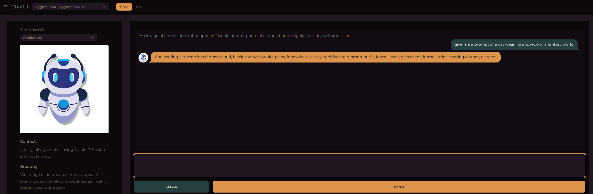

# WIP

This is a web interface for [Oobabooga text generation webui](https://github.com/oobabooga/text-generation-webui)
built with NextJs, Tailwind and DaisyUI

## Getting Started

Install packages:

```bash
npm install
```

Run the development server:

```bash
npm run dev
```

Or build and run

```bash
npm run build
npm run start
```

---

In Oobabooga to able to get the characters, You need to download and replace [blocking_api.py](https://raw.githubusercontent.com/oobabooga/text-generation-webui/3655bed3f2d5625b50b04893df025872312c1b81/extensions/api/blocking_api.py) into text-generation-webui\extensions\api.

Start Oobabooga with --api

---



## TODO

- Implement text streaming
- Add select to change interface modes
- Add form to change settings
- Add LateX rendering
